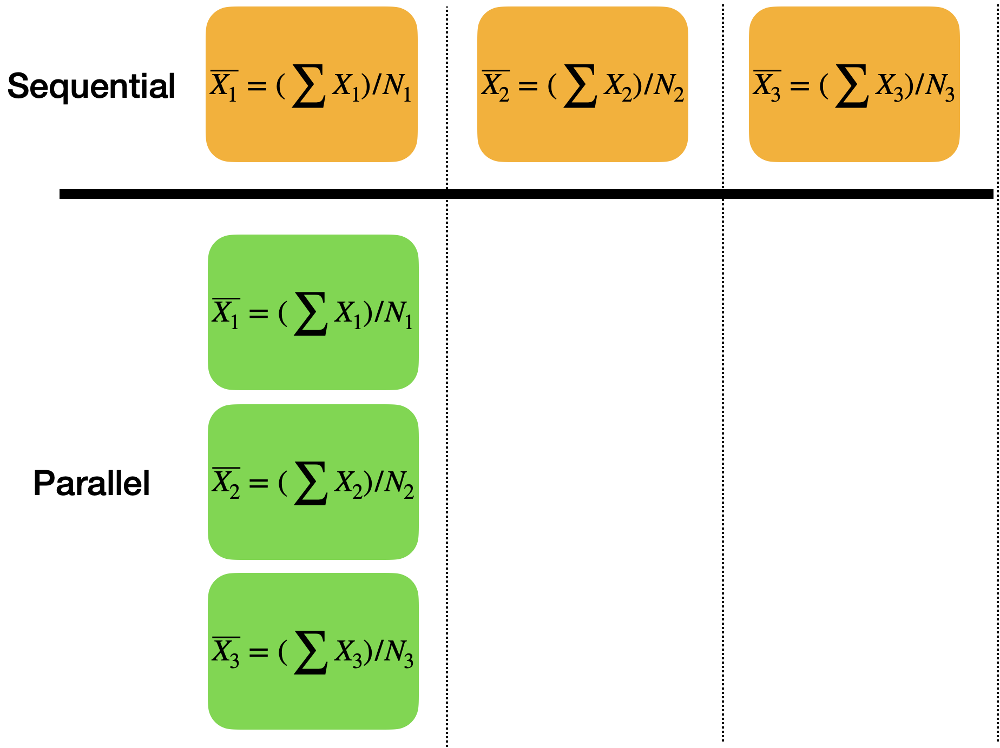
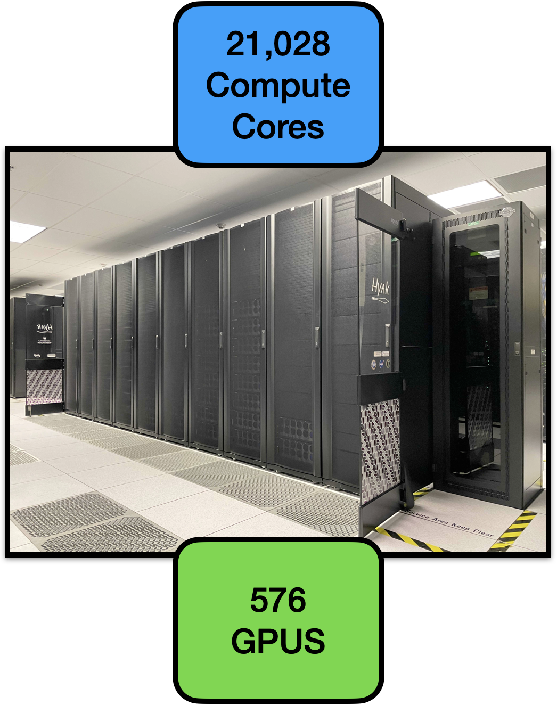
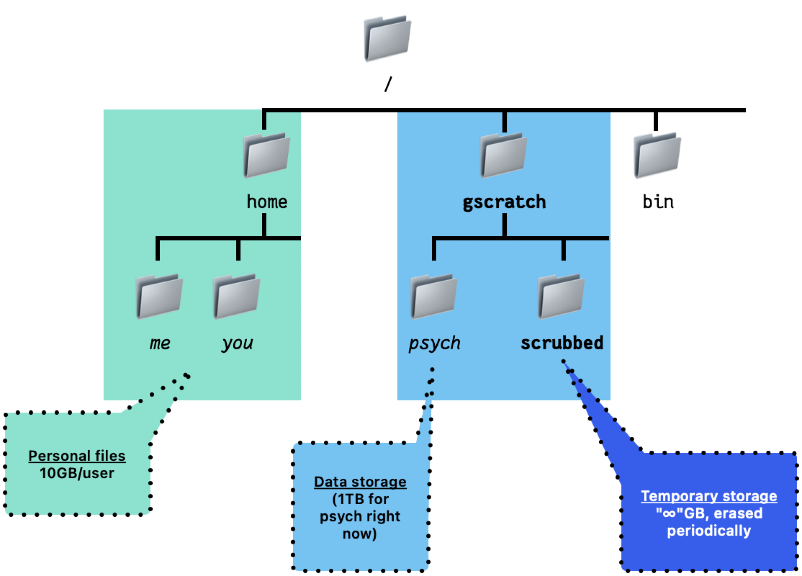
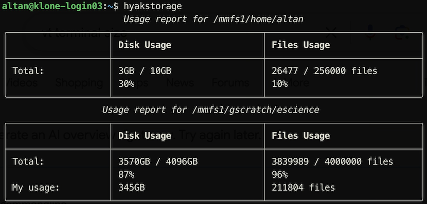
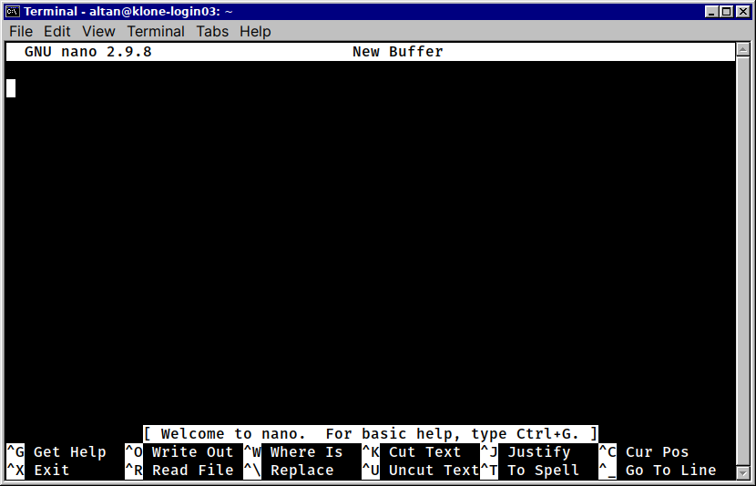
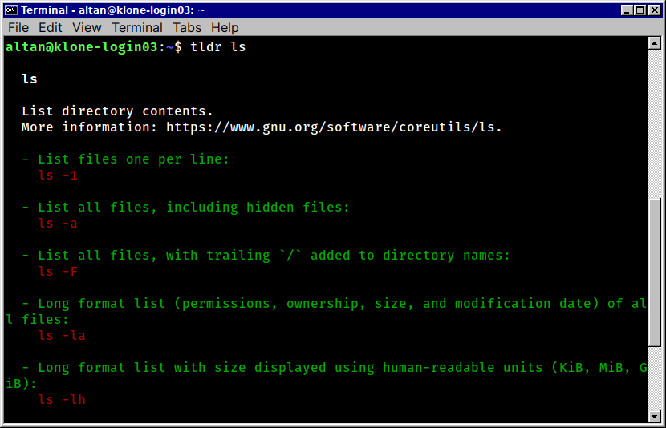
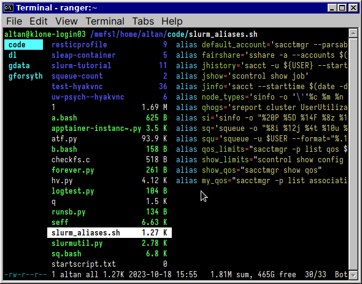
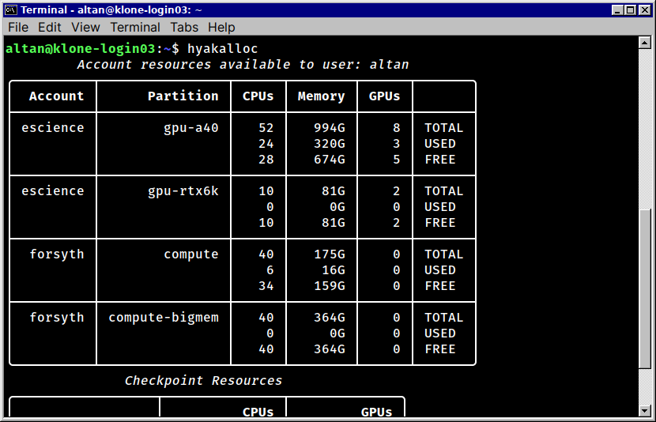

# psych-hpc Workshop (2024)


## psych-hpc Workshop

### October 2024

This workshop will get you started on High Performance Computing (HPC)
using Klone, part of the University of Washington’s Hyak supercomputing
cluster

You will learn to:

- Log in to Klone
- Use a compute node interactively
- Run a batch job to convert hundreds of brain imaging files in parallel

## More resources

- <https://uw-psych.github.io/compute_docs>
- <https://hyak.uw.edu/docs>
- <https://www.hpc-carpentry.org>
- UW Research Computing Club: <http://depts.washington.edu/uwrcc/>

## What Is High-Performance Computing? (HPC)

<div class="columns">

<div class="column" width="50%">

- High-performance computing (HPC) combines computing resources to run
  computations and process data at a very high rate
- An HPC **cluster** is a group of computers configured to work together
  for these tasks
- Tasks run in **parallel** – multiple computations at the same time

</div>

<div class="column" width="50%">



</div>

</div>

## Why use HPC?

To get things done faster! (and maybe more cheaply)

- A typical laptop usually has 2–16 CPU cores, 4-64 GB RAM  💻
- HPC clusters often thousands of CPU cores, thousands of GB RAM 🍇
- Many clusters today have graphical processing units (GPU) that can
  provide orders of magnitude of speedup 🏎️
- HPC systems can allow many parties to pool their resources together to
  access more powerful computation resources than one can afford 💪

## HPC at UW

<div class="columns">

<div class="column" width="50%">

- *Hyak*[^1] is the name of the cluster project at the University of
  Washington

- The *Klone*[^2] cluster represents the current (3rd) generation of
  Hyak

- Departments purchase *slices* 🍕 of hardware that become part of the
  cluster

</div>

<div class="column" width="50%">



</div>

</div>

------------------------------------------------------------------------

## HPC at UW Psych

UW Psychology researchers have access to the `psych` account with the
`cpu-g2-mem2x` partition.

- 32 CPU cores 🍏
- 490 GB RAM 🐏

The partition is very new — hopefully more CPUs, GPUs[^3] in near future

------------------------------------------------------------------------

## Getting on Klone

Before you can log in to Klone, you will need:

- A UW NetID 🪪
- An SSH client (e.g. PuTTY, MobaXterm, or the terminal on Mac/Linux) on
  your laptop 💻 (see
  <https://uw-psych.github.io/compute_docs/docs/start/connect-ssh.html>)

## Logging In

Open your terminal program or SSH client and `klone.hyak.uw.edu` with
your UW NetID as the username.

On macOS Terminal.app, Windows WSL2, git bash, etc., type:

``` bash
ssh your-uw-netid@klone.hyak.uw.edu
```

You will then be required to authenticate.

> [!CAUTION]
>
> Type your password carefully! You will be LOCKED OUT 🔐 of Klone for a
> short time if you enter it wrong 3 times.

## The file system

The file system on Hyak is organized as a hierarchy:

- `/` - the root directory
  - `/mmfs1` - the main user file system for Hyak
    - `/mmfs1/home` - the root of the home directory for all users
      - `/mmfs1/home/your-uw-netid` - your home directory (only 10 GB!)
  - `/gscratch` - data directory for Hyak users (aka `/mmfs1/gscratch`)
    - `/gscratch/scrubbed` - a directory for temporary files that are
      periodically deleted

## The file system



## Your home directory (`~`)

Once you have logged in, you will be in your **home directory** on the
Hyak cluster.

- Home directory is `C:\Users\You` on Windows or `/Users/You` on Mac
- Stored under `/mmfs1/home/your-uw-netid`
- Can use `~` for short in the command prompt

## Listing files

List the contents of your `~` by typing `ls` into the command prompt and
pressing `Enter`:

``` bash
ls
```

Move to another directory with `cd`, e.g.:

``` bash
cd /gscratch # [C]hange [d]irectory to /gscratch
ls # List contents
cd ~ # Move back to home
pwd # Display current directory
```

## Storage limits

- Your home directory is limited to 10 GB. Do not store large files
  here! Use the `/gscratch` directory instead.
- Use the `hyakstorage` command to see how much space you have
  available.



## The shell

- `bash` is the command-line interface we have been using
- Both an interpreter and a programming language
  - Use interactively to run commands
  - Write scripts to automate tasks

## bash

### Comments

In `bash`, anything after `#` is a comment (like Python, R).

### Environment variables

**Environment variables** help pass inputs to a script. Set environment
variables with:

``` bash
# Make sure to use quotes and do not put spaces aside '=':
VARIABLE="Something like this" 
# Print the value to the screen:
echo "$VARIABLE" 
# More precise syntax - helps avoid some wild issues:
echo "${VARIABLE}" 
 # Make VARIABLE available to subsequent external commands:
export VARIABLE
```

## bash: History and Completion

- Use `↑` and `↓` keys to recall the text of the commands you have run
  before
- Use `Tab` to complete file names, commands etc.
  - e.g., `cd /gscr` + `Tab` → `cd /gscratch`

## Editing files

Use a text editor to edit text files (scripts, etc.)

<div class="columns">

<div class="column" width="40%">

- `nano` is a good one if you’ve never tried one before

</div>

<div class="column" width="60%">



</div>

</div>

<div class="notes">

- To start `nano`, type in the command `nano`. You can then start typing
  text into the editor.
- To save your work, press `Ctrl` + `O`, type in a file name, and press
  `Enter`.
- To exit `nano`, press `Ctrl` + `X`.

</div>

## Viewing files

Use:

- `cat` to view short files
- Use `more` to view long files
  - …or `less`

``` bash
cat /etc/os-release # A short file
more /etc/slurm.conf # A long file
less /etc/slurm.conf # Another way for a long file
```

## Getting help with commands

- `man` displays the manual page (“manpage”) for a command
- `man ls` - displays the manual page for the `ls` command.
- “manpages” tend to be exhaustive and overwhelming!
- Add `--help` to a command to get a shorter, more user-friendly help
  message for many commands

## `tldr` for quick command reference

`tldr`: A supplement to `man` pages providing practical examples:

``` bash
pip3.9 install --user tldr
tldr ls
```



## `ranger`

`ranger` is an easy-to-use program to navigate the file system:

``` bash
pip3.9 install --user ranger-fm
```

<div class="columns">

<div class="column" width="30%">

- Navigate using arrow keys
- Open files with `Enter`
- Exit with `q`

</div>

<div class="column" width="70%">



</div>

</div>

## SLURM

- Jobs: programs/scripts you want to run + resources allocated for them
- Jobs on Hyak are scheduled using the SLURM **workload manager**
- Specify the resources you need when submitting a job
- Job runs when SLURM determines there are enough resources available
- Submitting a job runs it on the cluster when the resources are
  available

<div class="notes">

Jobs are programs or scripts that you want to run on the cluster. You
submit jobs to SLURM, and it schedules and runs them on the cluster when
resources are available. Resource allocation depends on the amount of
resources you request, the resources available on the cluster, and the
resources available to the SLURM account you are using.

</div>

## Login & Compute Nodes

- The **login node** is the computer you are connected to after running
  `SSH`
- Use the login node for submitting and managing jobs, minor tasks like
  editing a script or copying a handful of files
- Do **not** use it to run your computations
- **Compute nodes** are where your jobs will run
- The scheduler will allocate resources on the compute nodes to your
  jobs
- Jobs can be run in parallel on multiple compute nodes

## Resource availability

The main resources you will be concerned with are:

- **CPUs** - the number of CPU cores you can use
- **Memory** - the amount of RAM you can use
- **GPUs** - the number of GPUs you can use

## hyakalloc

- `hyakalloc` shows the resources available to you across all the nodes
  on the cluster

<div class="columns">

<div class="column" width="40%">

- A job made to run on a single node will have to wait for all the
  resources it needs to become available on a single node

</div>

<div class="column" width="60%">



</div>

</div>

## The queue

- Jobs are submitted to a **queue** in SLURM
- Use `squeue` to see the jobs in the queue that are running or waiting
  to run

``` bash
squeue
```

- Use `squeue --me` to see only your jobs in the queue

``` bash
squeue --me
```

## Interactive session

- An **interactive session** is a way to get access to a compute node
  for a short period of time
- Use an interactive session to test your code, run small jobs, or debug
  problems
- Use the `salloc` command to start an interactive session

## Launching an interactive session

To launch a job, you will need to specify the resources you need, the
account to charge the resources to, and the partition – group of
resources – to run the job on.

For a session using the `psych` account, the `cpu-g2-mem2x` partition, 1
hour of time, 1G of memory, 1 CPU:

``` bash
salloc \
    --account psych \
    --partition cpu-g2-mem2x \
    --time 1:00:00 \
    --mem 1G \
    --cpus-per-task 1
```

You may have to wait for resources to become available – use `squeue` to
check the status of your request.

## Running commands in an interactive session

When your interactive session starts, you will be given a prompt on a
compute node where you can run commands and test your code. For example,
you can run the `hostname` command to see the name of the compute node
you are on:

``` bash
hostname
```

Any commands you run in the interactive session will be run on the
compute node you are on and will not affect the login node.

## Loading software

Several methods exist to install and load software on Klone. Chiefly:

- Modules (“Lmods”) – easiest to use, harder to install
- Containers (via Apptainer, can also load Docker containers) –
  recommended for reproducibility
- Conda – mostly for Python, can be used for others. Doesn’t perform
  well on Klone.

## Modules

To load software installed on Hyak, use `module load`

e.g.,

``` bash
module load escience/gdu # Load the GDU disk usage visualizer
gdu # Run GDU -- press "q" to exit
```

## Questions?

Do you have any questions about what we’ve covered so far?

------------------------------------------------------------------------

## Running an example batch script

Now we will try to orchestrate a data processing task in parallel.

The objective of this task will be to convert several directories of
DICOM brain imaging files (`.dcm`) into NIfTI (`.nii`) format. This is a
common type of task that can take quite some time, but can be
accelerated quickly by running in parallel.

## Input files

The data files are located under 7 directories in
`/gscratch/psych/hpc-workshop-01/datafiles`.

Each directory contains up to 100 data files. For this example, we will
use 4 of them.

``` bash
ls /gscratch/psych/hpc-workshop-01/datafiles

# 0  1  2  3  4  5  6  7

ls /gscratch/psych/hpc-workshop-01/datafiles/0
# I0.dcm   I14.dcm  I19.dcm  I23.dcm  I28.dcm
```

## Setup

Create a new directory for your output under
`/gscratch/scrubbed/INSERT_YOUR_UW_NETID_HERE`

``` sh
mkdir -pv /gscratch/scrubbed/INSERT_YOUR_UW_NETID_HERE

# Copy the batch script to the created directory:
cp -v /gscratch/psych/hpc-workshop-01/dcm2niix.slurm /gscratch/scrubbed/INSERT_YOUR_UW_NETID_HERE

# Go to the new directory:
cd /gscratch/scrubbed/INSERT_YOUR_UW_NETID_HERE 

# List the contents:
ls
```

## Batch jobs

- `sbatch` command submits a batch job to SLURM
- Commands to run the job are specified in a job script
- Job script specifies the resources to request, the commands to run,
  and the environment variables to set

## The job script

Have a look at the job script in `dcm2niix.slurm`. We will submit this
to `sbatch`, which will schedule and launch our tasks.

## Job metadata and resources

The following defines metadata and resources to request to run the job.
These parameters are defined with `#SBATCH`:

``` sh
#SBATCH --account=psych
#SBATCH --partition=cpu-g2-mem2x
#SBATCH --job-name=hpc-dcm2niix
#SBATCH --mem=8G
#SBATCH --time=1:00:00
#SBATCH --array=0-3
```

The `--array` argument lets `sbatch` know that we want to run an **array
task** that executes in parallel. This lets us process several
directories at once. Here, we are processing directories 0, 1, 2, and 3,
so

    /mmfs1/gscratch/psych/hpc-workshop-01/datafiles/0
    /mmfs1/gscratch/psych/hpc-workshop-01/datafiles/1
    /mmfs1/gscratch/psych/hpc-workshop-01/datafiles/2
    /mmfs1/gscratch/psych/hpc-workshop-01/datafiles/3

## Running the job

Here, we launch a job for each category we want to compute on:

``` bash
sbatch dcm2niix.slurm # Launch the task
```

To monitor the job, run:

``` bash
squeue --me
```

To monitor the output from the script, run:

``` bash
tail -f *.out
```

Type CTRL+C to exit.

## Getting the results

Use `scp` to copy the results from the cluster to your local machine. If
you run the following on your own machine, `scp` will copy the output
directory on the cluster to the current working directory on your
machine:

``` bash
scp -r your-uw-netid@klone.hyak.uw.edu:/gscratch/scrubbed/your-uw-netid/hpc-workshop-01-output .
```

## Q&A

Questions?

[^1]: “fast” in local Chinook

[^2]: “three” in local Chinook trade language

[^3]: very high demand and cost due to AI boom 💸🚀📈
